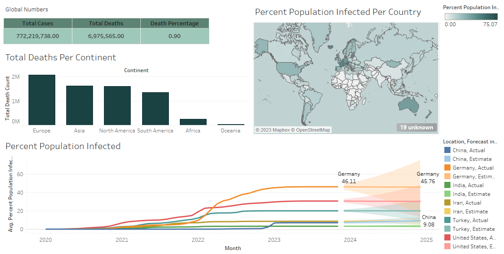

# COVID-19 Data Analysis: Infection and Death using Tableau & SQL

In this project, we used SQL for Data Exploration and then visualized the data in Tableau.

## Prerequisites

+ SQL Server
+ Tableau

## Data Source

[COVID-19 Dataset](https://ourworldindata.org/covid-deaths)

## Tableau Dashboard

Examining the total number of deaths caused by COVID in the world and different continents, as well as the average infected population in densely populated and developed countries and the Middle East from the beginning to now and the forecast for the next year.

